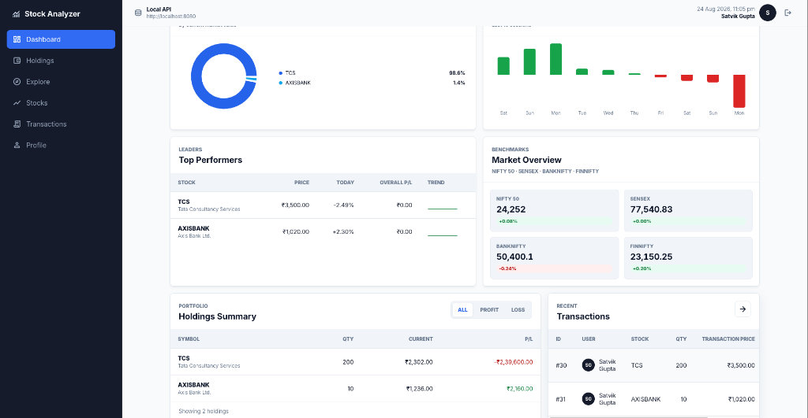
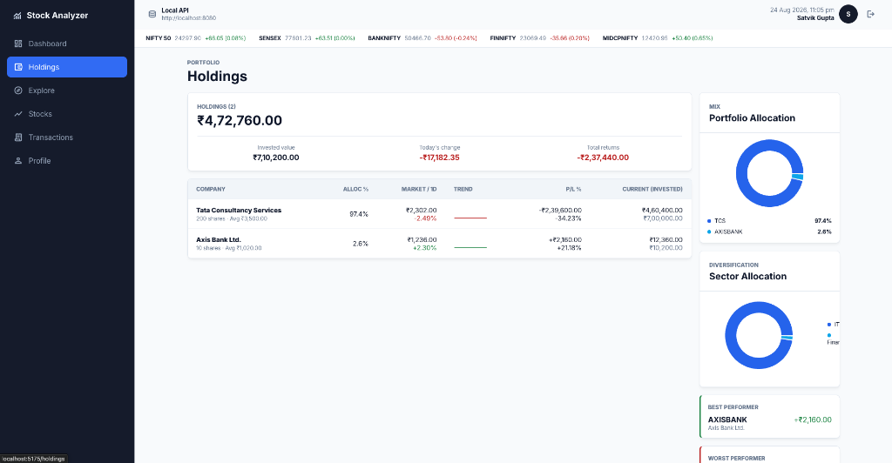
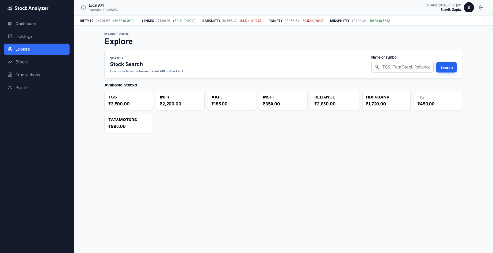
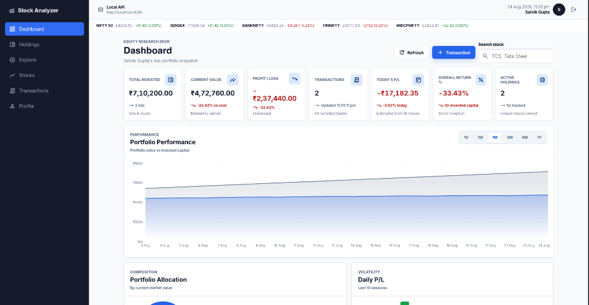

A MINI PROJECT REPORT On "STOCK PORTFOLIO ANALYZER"

Submitted by  <b>SATVIK GUPTA</b> University Roll No.: 2400950100083

In partial fulfilment of the requirements for the award of the degree of  <b>BACHELOR OF TECHNOLOGY</b> In <b>COMPUTER SCIENCE & ENGINEERING</b>

DEPARTMENT OF COMPUTER SCIENCE & ENGINEERING Mahatma Gandhi Mission's College of Engineering & Technology, Noida  August, 2026  SUBJECT CODE: MINI PROJECT

<h1 class="center">CERTIFICATE</h1>

This is to certify that the Mini Project Report entitled “STOCK PORTFOLIO ANALYZER” is a bona fide record of the work carried out by <b>SATVIK GUPTA</b> (University Roll No. 2400950100083), a student of the Third Year B.Tech programme in the Department of Computer Science & Engineering, Mahatma Gandhi Mission's College of Engineering and Technology, Noida, during the period 25th June 2026 to 5th August 2026, under supervision and guidance, in partial fulfilment of the requirements for the award of the degree of Bachelor of Technology in Computer Science & Engineering.

The matter embodied in this report has not been submitted, in part or in full, to any other University or Institute for the award of any other degree or diploma.

 
<table style="border:none; margin-top: 50px;">
<tr style="border:none;">
<td style="border:none; text-align: left;">Date: ______________</td>
<td style="border:none; text-align: left;">Place: Noida</td>
</tr>
<tr style="border:none; height: 80px;">
<td style="border:none;"></td><td style="border:none;"></td>
</tr>
<tr style="border:none;">
<td style="border:none; text-align: left;">___________________________ <b>Internal Guide</b></td>
<td style="border:none; text-align: left;">___________________________ <b>Head of Department</b></td>
</tr>
</table>

<h1 class="center">DECLARATION</h1>

I, <b>SATVIK GUPTA</b>, hereby declare that the Mini Project Report entitled “STOCK PORTFOLIO ANALYZER”, submitted in partial fulfilment of the requirements for the award of the degree of Bachelor of Technology in Computer Science & Engineering at Mahatma Gandhi Mission's College of Engineering and Technology, Noida, is an authentic and original record of the work carried out by me during the period 25th June 2026 to 5th August 2026.

I further declare that this report has not been submitted earlier for the award of any degree or diploma of this or any other Institute, and that all sources of information used have been duly acknowledged.

 

Date: ______________

Place: Noida

 

Signature of the Candidate

<b>SATVIK GUPTA</b>

University Roll No.: 2400950100083

<h1 class="center">ACKNOWLEDGEMENT</h1>

I express my sincere gratitude to the Department of Computer Science & Engineering, Mahatma Gandhi Mission's College of Engineering and Technology, Noida, for providing the opportunity to undertake this mini project. I am thankful to my Internal Guide and the Head of the Department for their valuable guidance and continuous encouragement throughout the project period (25th June 2026 – 5th August 2026).

I also acknowledge the open-source communities behind React.js, Spring Boot, Hibernate, MySQL, JWT, BCrypt, and related tools that made the development of this full-stack application possible.

 

<b>SATVIK GUPTA</b>

<h1 class="center">ABSTRACT</h1>

Manual management of stock investments through notebooks or spreadsheets is time-consuming, error-prone, and lacks the ability to provide investors with a real-time, consolidated view of their financial holdings. The Stock Portfolio Analyzer is a full-stack, three-tier web application designed to address these shortcomings by offering investors a centralized, digital platform to securely register, track, and analyze their stock market investments.

The system is built using React.js on the presentation layer, Spring Boot with Spring MVC and Spring Data JPA on the business logic layer, and MySQL as the persistent relational data store, with all inter-tier communication realized through a protected RESTful API. A key feature of the final implementation is the robust security architecture utilizing JSON Web Tokens (JWT) for stateless authentication and BCrypt for secure password hashing. The application supports secure user registration, login, profile management, maintenance of a master list of tradable stocks, execution of buy and sell transactions, and computation of running portfolio holdings. Furthermore, it strictly enforces authenticated user ownership, ensuring data privacy and integrity across all operations.

The backend follows a layered Controller–Service–Repository–Entity design, leveraging Hibernate as the Object-Relational Mapping (ORM) provider. The REST APIs include fully protected endpoints for personalized dashboards, transaction histories, and data exports (CSV and Excel). The resulting system demonstrates the practical application of modern full-stack development principles to a real-world personal finance problem. This report discusses the system’s architecture, database design, API specifications, and testing outcomes, alongside its advantages, limitations, and scope for future enhancement.

<b>Keywords:</b> Stock Portfolio Management, Full-Stack Web Application, Spring Boot, React.js, REST API, MySQL, JWT Authentication, BCrypt, Three-Tier Architecture, Hibernate ORM.

<h1 class="center">TABLE OF CONTENTS</h1>

<i>(Table of Contents will be generated by the PDF renderer)</i>

<h1 class="center">LIST OF FIGURES</h1>

Figure 4.1: Three-Tier Architecture of the System 
Figure 4.2: Controller–Service–Repository–Entity Flow 
Figure 4.3: JWT Authentication Architecture Flow 
Figure 5.1: Entity Relationship Diagram 
Figure 8.1: Login Interface 
Figure 8.2: User Signup Interface 
Figure 8.3: Portfolio Dashboard 
Figure 8.4: Holdings Interface 
Figure 8.5: Stock Explorer 
Figure 8.6: Transaction History 
Figure 8.7: User Profile and Portfolio Summary 
Figure 8.8: Change Password Interface

<h1 class="center">LIST OF TABLES</h1>

Table 3.1: Frontend Technology Stack 
Table 3.2: Backend Technology Stack 
Table 3.3: Database and Testing Tools 
Table 5.1: Structure of the users Table 
Table 5.2: Structure of the stock Table 
Table 5.3: Structure of the transaction Table 
Table 7.1: Authentication APIs 
Table 7.2: Profile and Export APIs 
Table 7.3: Stock and Transaction APIs 
Table 9.1: Comprehensive Test Cases and Results 
Table 10.1: Advantages of the Proposed System 
Table 10.2: Limitations of the Proposed System 
Table A.1: List of Abbreviations

<h1 class="page-break">CHAPTER 1: INTRODUCTION</h1>
<h2>1.1 Overview</h2>

Investing in the stock market has become increasingly accessible, yet effectively tracking and analyzing a personal investment portfolio remains a challenge for many retail investors who still rely on notebooks or generic spreadsheets. The Stock Portfolio Analyzer is a full-stack web application that provides a dedicated, centralized digital platform to securely register users, maintain a catalogue of stocks, record buy and sell transactions, and obtain a consolidated view of portfolio composition and value.

The application follows a three-tier architecture separating the presentation layer (React.js), the business logic layer (Spring Boot), and the data persistence layer (MySQL), communicating through a well-defined and protected REST API. A core component of the modern system is its security infrastructure, relying on JSON Web Tokens (JWT) and BCrypt password hashing to ensure strict data privacy and user ownership. This report documents the complete design and implementation of the system.

<h2>1.2 Problem Statement</h2>

Managing a stock portfolio manually using notebooks or spreadsheets is time-consuming and error-prone for several reasons:

<ul>
<li><b>Manual Portfolio Tracking:</b> Manual entry of transactions is tedious and prone to calculation errors as transaction volume grows.</li>
<li><b>Fragmented Transaction Records:</b> There is no structured, easily queryable transaction history linking a specific user, stock, and the action performed over time.</li>
<li><b>Calculation Difficulty:</b> Computing running portfolio value, average purchase price, and realized/unrealized profit/loss requires fragile, manually maintained formulas.</li>
<li><b>Lack of Secure Authentication:</b> Spreadsheets provide no secure authentication, leaving personal financial data vulnerable.</li>
<li><b>Lack of Centralized Visibility:</b> Investors struggle to get a unified snapshot of their net worth across different equity holdings.</li>
<li><b>Difficulty Maintaining Personal Records:</b> Without a centralized database, maintaining historical data across devices is challenging.</li>
<li><b>Lack of Convenient Data Export:</b> Consolidating data for tax purposes or external analysis is cumbersome without automated CSV or Excel export features.</li>
</ul>

The proposed Stock Portfolio Analyzer solves these problems through a centralized, rule-enforcing digital platform backed by a relational database and accessed via a responsive, highly secure web interface.

<h2>1.3 Objectives of the Project</h2>

The primary objectives of the Stock Portfolio Analyzer project are to:

<ul>
<li>Provide a digital, centralized platform for personalized portfolio management, eliminating manual record-keeping.</li>
<li>Implement secure authentication using JWT and robust password security using BCrypt hashing.</li>
<li>Support reliable Create, Read, Update, and Delete (CRUD) operations for users, stocks, and transactions via protected REST APIs.</li>
<li>Ensure consistent data management and relational integrity using a well-normalized MySQL database.</li>
<li>Automate complex holdings calculations, including average buy price, invested value, and real-time profit/loss.</li>
<li>Deliver personalized profile management features, including secure password changes and profile updates.</li>
<li>Enable convenient data export functionality, allowing users to download their transaction history (CSV) and portfolio summary (Excel).</li>
<li>Design a simple, responsive user interface requiring minimal learning effort.</li>
<li>Build on a scalable, layered (Controller–Service–Repository–Entity) architecture for future extensibility.</li>
</ul>

<h2>1.4 Scope of the Project</h2>

The current implementation covers secure user registration and login, a master stock catalogue, buy/sell transaction recording, real-time computation of holdings and investment value, profile management, and comprehensive data export capabilities (CSV and Excel). A REST API layer exposes these capabilities to the React frontend, tightly guarded by JWT authorization ensuring strict user data isolation.

Features such as live stock price feeds, AI-based investment recommendations, advanced visual analytics with charts, automated email alerts, and a dedicated mobile application are identified as future scope and are outside the current implementation, which focuses on establishing a robust, secure, and accurate core transaction engine.

<h1 class="page-break">CHAPTER 2: SYSTEM ANALYSIS</h1>
<h2>2.1 Existing System</h2>

Most retail investors who do not use dedicated portfolio software rely on manual notebooks, generic spreadsheets with self-designed formulas, or the fragmented transaction history provided by individual brokerage platforms. These approaches lack data validation, do not scale well as transaction volume grows, offer no structured way to query historical data, and enforce no business rules.

<h2>2.2 Problems in Existing System</h2>

The existing manual methods present several significant challenges:

<ul>
<li>Spreadsheets enforce no referential integrity, allowing inconsistent entries such as selling shares that were never purchased.</li>
<li>Manual calculations for average cost basis and profit/loss are highly susceptible to human error.</li>
<li>Data privacy is virtually non-existent, as files are easily shared or misplaced without cryptographic protection.</li>
<li>Aggregating historical transactions for reporting or tax filing requires manual extraction and formatting.</li>
<li>Multi-device synchronization is often difficult and prone to version conflicts.</li>
</ul>

<h2>2.3 Proposed System</h2>

The proposed Stock Portfolio Analyzer overcomes these limitations by introducing a dedicated three-tier web application with a relational database and comprehensive security model at its core, offering:

<ul>
<li>A structured relational schema enforcing referential integrity via primary and foreign keys.</li>
<li>A stateless, JWT-protected RESTful API layer exposing well-defined endpoints.</li>
<li>A dedicated Service layer that centralizes business logic, such as portfolio valuation, sell-transaction validation, and BCrypt password verification.</li>
<li>A responsive, component-based React.js frontend with a personalized dashboard, stock explorer, transaction history, and detailed profile page.</li>
<li>Automated CSV and Excel export generation for seamless data portability.</li>
</ul>

<h2>2.4 Advantages of Proposed Approach</h2>

The integration of JWT authentication, BCrypt, and authenticated ownership represents a massive improvement over basic user-management approaches. By identifying the user exclusively through a cryptographically signed token rather than trusting a frontend-supplied ID, the system completely eliminates Insecure Direct Object Reference (IDOR) vulnerabilities. Users can only access their own profile, transactions, and holdings, guaranteeing privacy. Furthermore, the automated calculation engine removes human error from portfolio valuation.

<h2>2.5 Feasibility Study</h2>
<h3>2.5.1 Technical Feasibility</h3>

The chosen technologies — React.js, Spring Boot, Spring Security, Spring Data JPA, Hibernate, and MySQL — are mature, well-documented, open-source tools that run efficiently on standard development machines. The project's technical requirements are well within the capabilities of a Third-Year B.Tech mini project.

<h3>2.5.2 Economic Feasibility</h3>

Every tool used in the development of the Stock Portfolio Analyzer is free and open-source. This includes React.js, Spring Boot, MySQL, Hibernate, Maven, IntelliJ IDEA, VS Code, and Bruno. Consequently, the project incurs zero recurring licensing costs, making it highly economically feasible.

<h3>2.5.3 Operational Feasibility</h3>

The simple, intuitive user interface allows a user with only basic computer literacy to securely register, add stocks, record transactions, and view their personalized portfolio dashboard without extensive training. The modular REST-based backend is straightforward to maintain, test, and extend in future iterations.

<h1 class="page-break">CHAPTER 3: TECHNOLOGY STACK AND TOOLS</h1>

The Stock Portfolio Analyzer has been developed using modern, industry-standard technologies chosen to provide a robust, secure foundation for a three-tier web application.

<h2>3.1 Frontend Technologies</h2>
<table>
<tr><th>Technology</th><th>Purpose</th></tr>
<tr><td>React.js</td><td>JavaScript library used to build a component-based, single-page user interface.</td></tr>
<tr><td>React Router</td><td>Library used for declarative routing and protected route enforcement.</td></tr>
<tr><td>HTML5 / CSS3</td><td>Used for structuring semantic content and implementing a responsive styling layout.</td></tr>
<tr><td>JavaScript (ES6+)</td><td>Core scripting language used for component logic and state management.</td></tr>
<tr><td>Axios</td><td>Promise-based HTTP client used to consume REST APIs, configured with interceptors to automatically attach JWT Bearer tokens.</td></tr>
</table>

Table 3.1: Frontend Technology Stack

<h2>3.2 Backend Technologies</h2>
<table>
<tr><th>Technology</th><th>Purpose</th></tr>
<tr><td>Java (JDK 17+)</td><td>Primary programming language used to implement the backend application.</td></tr>
<tr><td>Spring Boot (4.0.7)</td><td>Framework used to rapidly build a stand-alone, production-ready backend.</td></tr>
<tr><td>Spring Security 6</td><td>Provides robust authentication and authorization, handling the JWT filter chain.</td></tr>
<tr><td>jjwt (io.jsonwebtoken)</td><td>Library used for generating, signing, and parsing JSON Web Tokens.</td></tr>
<tr><td>BCryptPasswordEncoder</td><td>Cryptographic hashing algorithm used to securely store user passwords.</td></tr>
<tr><td>Spring Data JPA</td><td>Simplifies data access by providing repository abstractions over the persistence provider.</td></tr>
<tr><td>Hibernate</td><td>Object-Relational Mapping (ORM) framework mapping Java entities to MySQL.</td></tr>
<tr><td>Apache POI (5.2.3)</td><td>Java library used for generating dynamic Excel (XLSX) portfolio export reports.</td></tr>
<tr><td>Maven</td><td>Build automation and dependency management tool.</td></tr>
</table>

Table 3.2: Backend Technology Stack

<h2>3.3 Database and Development Tools</h2>
<table>
<tr><th>Tool</th><th>Purpose</th></tr>
<tr><td>MySQL</td><td>Relational database management system (RDBMS) used for all persistent data storage.</td></tr>
<tr><td>VS Code</td><td>Lightweight editor used for frontend (React.js) development.</td></tr>
<tr><td>IntelliJ IDEA</td><td>IDE used for backend (Java/Spring Boot) development.</td></tr>
<tr><td>Bruno / curl</td><td>Tools used to manually construct and test REST endpoints during development.</td></tr>
</table>

Table 3.3: Database and Testing Tools

<h1 class="page-break">CHAPTER 4: SYSTEM ARCHITECTURE AND DESIGN</h1>
<h2>4.1 Three-Tier Architecture</h2>

The Stock Portfolio Analyzer follows a classic three-tier architecture, separating the application into logically distinct layers: Presentation, Business Logic, and Database. This separation of concerns significantly improves maintainability, scalability, and security.

<pre>
[ PRESENTATION LAYER ]
 React.js + Axios (JSON)
          |
          | REST (HTTP) + Bearer JWT
          v
[ BUSINESS LOGIC LAYER ]
 Spring Boot + Spring Security
 Service Layer
 Repository Layer (Spring Data JPA)
          |
          | JPA / JDBC
          v
[ DATABASE LAYER ]
 MySQL (stock_portfolio)
</pre>

Figure 4.1: Three-Tier Architecture of the System

<h2>4.2 Controller-Service-Repository-Entity Architecture</h2>

Within the Spring Boot backend, the application utilizes a layered design pattern:

<ul>
<li><b>Controller:</b> Annotated with <code>@RestController</code>, these classes expose REST endpoints, parse incoming JSON HTTP requests, and delegate processing to the Service layer.</li>
<li><b>Service:</b> Contains the core business logic. It handles tasks such as portfolio valuation, transaction validation, BCrypt password verification, and Excel/CSV generation.</li>
<li><b>Repository:</b> Interfaces extending <code>JpaRepository</code> that provide built-in and custom CRUD methods for database access without writing boilerplate SQL.</li>
<li><b>Entity:</b> Plain Old Java Objects (POJOs) annotated with <code>@Entity</code>, mapped directly by Hibernate to the corresponding MySQL database tables.</li>
</ul>

<h2>4.3 Authentication Architecture</h2>

The system employs a stateless, token-based authentication mechanism using JSON Web Tokens (JWT) and BCrypt.

<b>Signup Flow:</b> When a user registers, their plaintext password is intercepted by the <code>AuthService</code>, hashed using <code>BCryptPasswordEncoder</code>, and stored securely in the database. The system immediately generates and returns a JWT.

<b>Login Flow:</b> The user submits their email and password. Spring Security retrieves the user record and verifies the password hash. If successful, a JWT is generated, signed with a secret key, and returned to the frontend. The frontend stores this token in <code>sessionStorage</code>.

<pre>
Client                 Spring Security                 Database
  |                           |                           |
  |--- POST /api/auth/login ->|                           |
  |   (email, password)       |                           |
  |                           |--- loadUserByEmail ------>|
  |                           |<------ User Record -------|
  |                           | (verify BCrypt hash)      |
  |<--- Returns JWT Token ----|                           |
  |                           |                           |
</pre>

Figure 4.3: JWT Authentication Architecture Flow

<h2>4.4 Request Lifecycle</h2>

For protected requests (e.g., viewing the dashboard), the lifecycle is as follows:

<ol>
<li><b>React Frontend:</b> Axios interceptor attaches the JWT to the <code>Authorization: Bearer &lt;token&gt;</code> header.</li>
<li><b>Security Filter:</b> <code>JwtAuthenticationFilter</code> intercepts the request, parses the token, validates the signature and expiration, and extracts the user email.</li>
<li><b>Security Context:</b> The user's authentication token is placed in the <code>SecurityContextHolder</code>.</li>
<li><b>Controller & Service:</b> The request reaches the Controller. The Service layer uses <code>CurrentUserService.getCurrentUser()</code> to retrieve the exact user entity making the request.</li>
<li><b>Repository & DB:</b> The Repository queries the database using the authenticated user's ID, ensuring they only retrieve their own data.</li>
<li><b>Response:</b> The data is returned as JSON to the frontend.</li>
</ol>

<h2>4.5 User Ownership Model</h2>

A critical architectural decision in the final implementation is the strict enforcement of user ownership. The backend <b>never</b> trusts a <code>userId</code> supplied by the frontend in a request payload or URL parameter for protected operations. Instead, the identity is always dynamically extracted from the cryptographically verified JWT in the Spring Security context. This guarantees that User A cannot manipulate a request payload to maliciously access or modify User B's portfolio, holdings, or profile, providing a robust defense against IDOR vulnerabilities.

<h1 class="page-break">CHAPTER 5: DATABASE DESIGN</h1>
<h2>5.1 Database Overview</h2>

The application uses a relational database named <code>stock_portfolio</code>, implemented in MySQL. The schema is designed according to normalization principles to eliminate redundancy and preserve data integrity, consisting of four principal tables: <code>users</code>, <code>stock</code>, <code>transactions</code>, and <code>watchlists</code>.

<h2>5.2 ER Diagram (Textual Representation)</h2>
<pre>
  +-------+ 1       N +--------------+ N       1 +-------+
  | users |-----------| transactions |-----------| stock |
  +-------+           +--------------+           +-------+
      | 1                                            | 1
      |               +--------------+               |
      +---------------|  watchlists  |---------------+
                    N +--------------+ N
</pre>

Figure 5.1: Entity Relationship Diagram

<h2>5.3 Users Table</h2>
<table>
<tr><th>Field</th><th>Data Type</th><th>Constraint</th><th>Description</th></tr>
<tr><td>id</td><td>BIGINT</td><td>PK, Auto Increment</td><td>Unique identifier for each user.</td></tr>
<tr><td>name</td><td>VARCHAR(255)</td><td>NOT NULL</td><td>Full name of the registered user.</td></tr>
<tr><td>email</td><td>VARCHAR(255)</td><td>NOT NULL, UNIQUE</td><td>Email address used for login.</td></tr>
<tr><td>password</td><td>VARCHAR(255)</td><td>NOT NULL</td><td>BCrypt hashed password.</td></tr>
</table>

Table 5.1: Structure of the users Table

<h2>5.4 Stock Table</h2>
<table>
<tr><th>Field</th><th>Data Type</th><th>Constraint</th><th>Description</th></tr>
<tr><td>id</td><td>BIGINT</td><td>PK, Auto Increment</td><td>Unique identifier for each stock.</td></tr>
<tr><td>symbol</td><td>VARCHAR(255)</td><td>NOT NULL, UNIQUE</td><td>Stock ticker symbol (e.g., TCS).</td></tr>
<tr><td>companyname</td><td>VARCHAR(255)</td><td>NOT NULL</td><td>Full registered name of the company.</td></tr>
<tr><td>sector</td><td>VARCHAR(255)</td><td>NULLABLE</td><td>Industry sector of the company.</td></tr>
<tr><td>currentprice</td><td>DOUBLE</td><td>NOT NULL</td><td>Latest recorded market price.</td></tr>
</table>

Table 5.2: Structure of the stock Table

<h2>5.5 Transaction Table</h2>
<table>
<tr><th>Field</th><th>Data Type</th><th>Constraint</th><th>Description</th></tr>
<tr><td>id</td><td>BIGINT</td><td>PK, Auto Increment</td><td>Unique identifier for each transaction.</td></tr>
<tr><td>user_id</td><td>BIGINT</td><td>FK → users(id)</td><td>References the user who performed the transaction.</td></tr>
<tr><td>stock_id</td><td>BIGINT</td><td>FK → stock(id)</td><td>References the stock involved.</td></tr>
<tr><td>quantity</td><td>INT</td><td>NOT NULL</td><td>Number of shares bought or sold.</td></tr>
<tr><td>price</td><td>DOUBLE</td><td>NOT NULL</td><td>Price per share at transaction time.</td></tr>
<tr><td>transaction_type</td><td>VARCHAR(255)</td><td>NOT NULL (BUY/SELL)</td><td>Indicates purchase or sale.</td></tr>
<tr><td>transaction_date</td><td>DATETIME(6)</td><td>NOT NULL</td><td>Date and time of the transaction.</td></tr>
</table>

Table 5.3: Structure of the transaction Table

<h2>5.6 Data Integrity and Security</h2>

Data integrity is enforced at the database level using Primary Keys (PK) and Foreign Keys (FK). The <code>user_id</code> and <code>stock_id</code> columns in the <code>transactions</code> and <code>watchlists</code> tables enforce strict referential integrity. Crucially, the <code>password</code> column in the <code>users</code> table is sized to accommodate a 60-character BCrypt hash. Plaintext passwords are never stored in the database, ensuring that even in the event of a database compromise, user credentials remain secure.

<h1 class="page-break">CHAPTER 6: MODULE DESCRIPTION</h1>
<h2>6.1 Authentication Module</h2>

The Authentication module manages secure access to the platform. It handles user registration (Signup) and session initiation (Login). The frontend collects credentials and stores the returned JWT. The backend verifies credentials, generates JWTs, and hashes passwords using BCrypt. Security is paramount here, ensuring passwords are never exposed in API responses.

<h2>6.2 Profile Module</h2>

The Profile module serves as the personal account center for the authenticated user. It displays personal information (Name, Email), a consolidated portfolio summary (Total Invested, Current Value, Profit/Loss), and allows the user to update their details or securely change their password. It also handles the orchestration of user logout by clearing the local session.

<h2>6.3 Stock Management Module</h2>

This module maintains the master catalogue of tradable stocks. It allows the retrieval of stock details, including symbols, company names, and current prices. This module provides the foundational market data required by the transaction and portfolio modules.

<h2>6.4 Transaction Management Module</h2>

The operational core of the system. It records every BUY and SELL action. The frontend provides a seamless interface for trade entry, while the backend rigorously validates transactions—most notably ensuring that a user cannot SELL more shares than they currently own (preventing negative holdings). It maintains a complete chronological history linked to the specific authenticated user.

<h2>6.5 Portfolio & Holdings Module</h2>

This module dynamically aggregates the user's transaction history to compute their current holdings. For each stock, it calculates the net quantity held, average purchase price, total invested value, current market value, and real-time profit/loss percentage. All calculations are performed on the backend to ensure consistency.

<h2>6.6 Dashboard Module</h2>

The Dashboard module provides a high-level, centralized overview of the user's financial standing. It aggregates data from the Portfolio module to present headline metrics: overall Total Invested, overall Current Value, and net Profit/Loss across all equities, alongside a snapshot of recent activity.

<h2>6.7 Data Export Module</h2>

A specialized module designed for data portability. It allows the authenticated user to download their financial records. The frontend handles Blob data conversion, while the backend utilizes Apache POI to generate comprehensive Excel workbooks (spanning multiple sheets for summaries, holdings, and transactions) and dynamic CSV files for transaction logs.

<h1 class="page-break">CHAPTER 7: SECURITY AND REST API DESIGN</h1>
<h2>7.1 REST API Principles</h2>

The backend exposes functionality through a stateless RESTful API. Resources are named using nouns, HTTP methods indicate the intended action, and standard HTTP status codes communicate outcomes. Request and response bodies are strictly encoded in JSON.

<h2>7.2 Authentication APIs (Public)</h2>

These endpoints are open and do not require a JWT.

<table>
<tr><th>Endpoint</th><th>Method</th><th>Auth</th><th>Purpose</th><th>Response</th></tr>
<tr><td>/api/auth/signup</td><td>POST</td><td>None</td><td>Registers a new user, hashes password via BCrypt.</td><td>200 OK + JWT</td></tr>
<tr><td>/api/auth/login</td><td>POST</td><td>None</td><td>Authenticates credentials and generates session token.</td><td>200 OK + JWT / 401</td></tr>
</table>

Table 7.1: Authentication APIs

<h2>7.3 Profile and Export APIs (Protected)</h2>

These endpoints require a valid JWT. They implicitly operate on the authenticated user derived from the token.

<table>
<tr><th>Endpoint</th><th>Method</th><th>Auth</th><th>Purpose</th><th>Response</th></tr>
<tr><td>/api/users/me</td><td>GET</td><td>JWT</td><td>Retrieves current user's profile details.</td><td>200 OK</td></tr>
<tr><td>/api/users/me</td><td>PUT</td><td>JWT</td><td>Updates current user's name or email.</td><td>200 OK</td></tr>
<tr><td>/api/users/me/password</td><td>PUT</td><td>JWT</td><td>Securely changes user's password.</td><td>200 OK / 401</td></tr>
<tr><td>/api/users/me/export/transactions/csv</td><td>GET</td><td>JWT</td><td>Generates a CSV of the user's transactions.</td><td>200 OK (text/csv)</td></tr>
<tr><td>/api/users/me/export/portfolio/excel</td><td>GET</td><td>JWT</td><td>Generates a multi-sheet Excel portfolio report.</td><td>200 OK (XLSX)</td></tr>
</table>

Table 7.2: Profile and Export APIs

<h2>7.4 Stock, Transaction, and Portfolio APIs (Protected)</h2>
<table>
<tr><th>Endpoint</th><th>Method</th><th>Auth</th><th>Purpose</th><th>Response</th></tr>
<tr><td>/api/dashboard</td><td>GET</td><td>JWT</td><td>Retrieves aggregated dashboard metrics.</td><td>200 OK</td></tr>
<tr><td>/api/portfolio</td><td>GET</td><td>JWT</td><td>Computes and retrieves current stock holdings.</td><td>200 OK</td></tr>
<tr><td>/api/transactions</td><td>GET</td><td>JWT</td><td>Retrieves full chronological transaction history.</td><td>200 OK</td></tr>
<tr><td>/api/transactions</td><td>POST</td><td>JWT</td><td>Records a new BUY or SELL transaction.</td><td>200 OK / 400</td></tr>
<tr><td>/api/stocks</td><td>GET</td><td>JWT</td><td>Retrieves master catalogue of available stocks.</td><td>200 OK</td></tr>
<tr><td>/api/watchlist</td><td>GET</td><td>JWT</td><td>Retrieves the user's saved watchlist.</td><td>200 OK</td></tr>
<tr><td>/api/watchlist</td><td>POST</td><td>JWT</td><td>Adds a stock to the user's watchlist.</td><td>200 OK</td></tr>
</table>

Table 7.3: Stock and Transaction APIs

<h2>7.5 Error Handling and Status Codes</h2>

The application strictly adheres to HTTP standards: <code>200 OK</code> for successful operations, <code>400 Bad Request</code> for invalid logic (e.g., selling unowned shares), <code>401 Unauthorized</code> for missing or invalid JWTs or incorrect current passwords, and <code>404 Not Found</code> for non-existent resources. Spring Boot's global exception handling intercepts errors to return clean, structured JSON error responses rather than stack traces.

<h1 class="page-break">CHAPTER 8: FRONTEND IMPLEMENTATION AND USER INTERFACE</h1>

This chapter presents the frontend user interface of the Stock Portfolio Analyzer. Implemented using React.js, the interface is designed to provide a seamless, secure experience. All screenshots are taken from the active, running application.

<h2>8.1 Login and Signup Pages</h2>

The authentication gateway to the application. The Signup page captures the user's name, email, and password. The Login page verifies these credentials. Upon successful authentication, the frontend receives a JWT, stores it securely, and redirects the user to the Dashboard. Unauthenticated attempts to access any other route automatically redirect back to the Login page.

<h2>8.2 Dashboard</h2>

Figure 8.3: Portfolio Dashboard

The Dashboard provides a personalized, centralized overview of the user's financial standing. It dynamically displays Total Invested, Current Value, and Unrealized Profit/Loss. It also highlights active holdings and recent transaction activity, pulling data securely via the <code>/api/dashboard</code> endpoint.

<h2>8.3 Holdings</h2>

Figure 8.4: Holdings Interface

The Holdings interface presents a detailed breakdown of the user's active portfolio. For each stock owned, it calculates the allocated percentage, average cost basis, current market value, and individual profit/loss, giving the investor granular insight into asset performance.

<h2>8.4 Explore and Stocks</h2>

Figure 8.5: Stock Explorer

The Explore page allows users to browse the master catalogue of available stocks. It includes search functionality and displays real-time pricing information for equities available to trade within the application simulator.

<h2>8.5 Transaction History</h2>

Figure 8.6: Transaction History

The Transactions page provides a comprehensive chronological ledger of all BUY and SELL activities performed by the user, detailing the date, asset, quantity, execution price, and total value of each trade.

<h2>8.6 Profile and Data Export</h2>

Figure 8.7: User Profile and Portfolio Summary

The Profile section acts as the user's account center. It displays authenticated personal details and a summary of their portfolio statistics. Crucially, it houses the <b>Data Management</b> controls, allowing users to export their transaction history as a CSV file or download a comprehensive, multi-sheet Excel portfolio report. It also includes the Logout functionality.

<h2>8.7 Change Password</h2>

Figure 8.8: Change Password Interface

Accessible from the Profile page, the Change Password modal allows users to securely update their credentials. It requires the user to input their current password (verified via BCrypt on the backend) before a new password can be established, ensuring account security.

<h1 class="page-break">CHAPTER 9: TESTING</h1>
<h2>9.1 Testing Strategy</h2>

The application underwent rigorous testing encompassing static analysis, backend unit testing, API validation, and manual end-to-end (E2E) regression testing. The testing strategy focused heavily on verifying security boundaries, JWT authorization, business logic constraints, and data export fidelity.

<h2>9.2 Build Verification</h2>

Prior to runtime testing, static validation was performed:

<ul>
<li><b>Frontend Linting:</b> <code>npm run lint</code> executed successfully with 0 errors (with a known non-blocking <code>exhaustive-deps</code> warning).</li>
<li><b>Frontend Build:</b> <code>npm run build</code> successfully bundled the React application for production.</li>
<li><b>Backend Tests:</b> <code>./mvnw test</code> completed with 0 failures and 0 errors, confirming core Spring Boot context initialization.</li>
</ul>

<h2>9.3 Comprehensive Test Cases</h2>
<table>
<tr><th>Test ID</th><th>Feature</th><th>Test Case</th><th>Expected Result</th><th>Actual Result</th><th>Status</th></tr>
<tr><td>TC-01</td><td>Signup</td><td>Register with valid unique email & password.</td><td>200 OK, JWT returned, password not exposed.</td><td>Passed, JWT issued.</td><td>PASS</td></tr>
<tr><td>TC-02</td><td>Login</td><td>Login with correct credentials.</td><td>200 OK, JWT generated.</td><td>Passed, JWT issued.</td><td>PASS</td></tr>
<tr><td>TC-03</td><td>Login</td><td>Login with invalid password.</td><td>401 Unauthorized.</td><td>Rejected with 401.</td><td>PASS</td></tr>
<tr><td>TC-04</td><td>Security</td><td>Access <code>/api/dashboard</code> without JWT.</td><td>401 Unauthorized.</td><td>Rejected with 401.</td><td>PASS</td></tr>
<tr><td>TC-05</td><td>Security</td><td>Access <code>/api/dashboard</code> with valid JWT.</td><td>200 OK, User A data returned.</td><td>Passed, data loaded.</td><td>PASS</td></tr>
<tr><td>TC-06</td><td>Isolation</td><td>User B attempts to view User A's transactions.</td><td>Empty list or User B's data only.</td><td>User B sees 0 transactions.</td><td>PASS</td></tr>
<tr><td>TC-07</td><td>Transactions</td><td>Execute BUY order.</td><td>200 OK, Holdings increase, Invested value updates.</td><td>Passed, Dashboard updated.</td><td>PASS</td></tr>
<tr><td>TC-08</td><td>Transactions</td><td>Execute SELL order exceeding held quantity.</td><td>400 Bad Request, transaction rejected.</td><td>Rejected with 400.</td><td>PASS</td></tr>
<tr><td>TC-09</td><td>Profile</td><td>Update Profile Name.</td><td>200 OK, name persists in DB.</td><td>Passed, name updated.</td><td>PASS</td></tr>
<tr><td>TC-10</td><td>Security</td><td>Change Password with wrong current password.</td><td>401 Unauthorized.</td><td>Rejected with 401.</td><td>PASS</td></tr>
<tr><td>TC-11</td><td>Security</td><td>Change Password with correct credentials.</td><td>200 OK, password updated via BCrypt.</td><td>Passed.</td><td>PASS</td></tr>
<tr><td>TC-12</td><td>Security</td><td>Login with old password after change.</td><td>401 Unauthorized.</td><td>Rejected with 401.</td><td>PASS</td></tr>
<tr><td>TC-13</td><td>Export</td><td>Download CSV Export.</td><td>Valid CSV file with accurate transaction history.</td><td>Passed, file downloaded.</td><td>PASS</td></tr>
<tr><td>TC-14</td><td>Export</td><td>Download Excel Export.</td><td>Valid XLSX with Summary, Holdings, Transactions sheets.</td><td>Passed, 3 sheets verified.</td><td>PASS</td></tr>
<tr><td>TC-15</td><td>Routing</td><td>Access frontend <code>/dashboard</code> unauthenticated.</td><td>Redirect to <code>/login</code>.</td><td>Passed, redirected.</td><td>PASS</td></tr>
</table>

Table 9.1: Comprehensive Test Cases and Results

<h1 class="page-break">CHAPTER 10: ADVANTAGES, LIMITATIONS AND FUTURE SCOPE</h1>
<h2>10.1 Advantages</h2>

The final implementation of the Stock Portfolio Analyzer provides significant advantages over manual tracking methods:

<ul>
<li><b>Robust Security:</b> Utilizing JWT for stateless authentication and BCrypt for password hashing ensures industry-standard data protection.</li>
<li><b>Strict Data Privacy:</b> The authenticated user ownership model rigorously isolates user data, preventing unauthorized access across accounts.</li>
<li><b>Automated Accuracy:</b> Real-time computation of holdings, average buy prices, and profit/loss eliminates human calculation errors.</li>
<li><b>Centralized Management:</b> A personalized Profile page consolidates personal info, portfolio summaries, and security settings in one accessible location.</li>
<li><b>Seamless Data Portability:</b> Automated CSV and multi-sheet Excel exports allow users to effortlessly download their financial records.</li>
<li><b>Scalable Architecture:</b> The strict separation of concerns across the React frontend and layered Spring Boot backend ensures the system is easily maintainable and extensible.</li>
</ul>

<h2>10.2 Limitations</h2>

While the core system is fully functional, certain limitations exist in the current version:

<ul>
<li><b>Static Market Data:</b> Stock prices currently rely on manual database updates rather than a live, real-time market data feed API.</li>
<li><b>Local Deployment:</b> The application is currently configured for a local development environment and lacks cloud-native deployment configurations.</li>
<li><b>Limited Analytics:</b> The application provides tabular data and summary metrics but currently lacks advanced graphical charts (e.g., line charts for performance over time).</li>
<li><b>No Automated Alerting:</b> Push notifications, SMS, or email alerts for significant portfolio changes are not yet integrated.</li>
</ul>

<h2>10.3 Future Scope</h2>

The modular architecture provides a strong foundation for future enhancements:

<ul>
<li><b>Real-Time API Integration:</b> Connecting to a financial market API (e.g., Alpha Vantage, Yahoo Finance) for live price updates.</li>
<li><b>Advanced Visual Analytics:</b> Implementing charting libraries (like Chart.js or Recharts) to provide visual representations of sector diversification and historical performance.</li>
<li><b>AI-Driven Recommendations:</b> Integrating predictive analytics to suggest portfolio rebalancing or highlight potential investment opportunities.</li>
<li><b>Cloud Deployment:</b> Containerizing the application with Docker and deploying it to cloud platforms like AWS or Heroku.</li>
<li><b>Mobile Application:</b> Developing a companion mobile application (e.g., using React Native) that consumes the existing REST APIs.</li>
</ul>

<h1 class="page-break">CHAPTER 11: CONCLUSION</h1>

The Stock Portfolio Analyzer project has successfully demonstrated the design, development, and implementation of a secure, full-stack, three-tier web application that addresses the inefficiency and error-proneness of manual portfolio management. By combining a modern React.js presentation layer, a robust Spring Boot business-logic layer, and a structured MySQL data layer, the project produced a highly cohesive system.

A major achievement of the final implementation is its rigorous security posture. The integration of JWT authentication, BCrypt password hashing, and strict authenticated-user ownership checks ensures that financial data remains private and protected. The layered Controller–Service–Repository–Entity pattern allowed development effort to focus on complex business logic, such as automated portfolio valuation, transaction validation, and the generation of dynamic CSV and Excel data exports.

Systematic end-to-end testing confirmed the functional correctness of the core flows and the impenetrability of the security boundaries. The project stands as a highly practical demonstration of modern full-stack technologies applied to a tangible personal-finance problem, providing a solid foundation for continued learning in financial technology, web security, and software engineering.

<h1 class="page-break">REFERENCES</h1>

[1] Spring Boot Official Documentation. Available at: https://docs.spring.io/spring-boot/documentation.html

[2] Oracle Java SE Documentation. Available at: https://docs.oracle.com/en/java/javase/

[3] MySQL 8.0 Reference Manual. Available at: https://dev.mysql.com/doc/

[4] Hibernate ORM User Guide. Available at: https://hibernate.org/orm/documentation/

[5] React Official Documentation. Available at: https://react.dev/

[6] JSON Web Token (JWT) Introduction. Available at: https://jwt.io/introduction

[7] Spring Security Reference. Available at: https://docs.spring.io/spring-security/reference/index.html

[8] Apache POI - the Java API for Microsoft Documents. Available at: https://poi.apache.org/

[9] REST API Design Resources. Available at: https://restfulapi.net/

[10] Spring Data JPA Reference Documentation. Available at: https://docs.spring.io/spring-data/jpa/reference/

<h1 class="page-break">APPENDIX</h1>
<h2>A.1 List of Abbreviations</h2>
<table>
<tr><th>Abbreviation</th><th>Expansion</th></tr>
<tr><td>API</td><td>Application Programming Interface</td></tr>
<tr><td>BCrypt</td><td>Blowfish Cryptographic Hashing Algorithm</td></tr>
<tr><td>CRUD</td><td>Create, Read, Update, Delete</td></tr>
<tr><td>CSV</td><td>Comma-Separated Values</td></tr>
<tr><td>HTTP</td><td>Hypertext Transfer Protocol</td></tr>
<tr><td>JPA</td><td>Java Persistence API</td></tr>
<tr><td>JSON</td><td>JavaScript Object Notation</td></tr>
<tr><td>JWT</td><td>JSON Web Token</td></tr>
<tr><td>MVC</td><td>Model-View-Controller</td></tr>
<tr><td>ORM</td><td>Object-Relational Mapping</td></tr>
<tr><td>REST</td><td>Representational State Transfer</td></tr>
<tr><td>RDBMS</td><td>Relational Database Management System</td></tr>
<tr><td>SPA</td><td>Single-Page Application</td></tr>
<tr><td>SQL</td><td>Structured Query Language</td></tr>
<tr><td>UI / UX</td><td>User Interface / User Experience</td></tr>
</table>

Table A.1: List of Abbreviations

